# Boligsiden EDA
Date: 20190610

## Flats in Copenhagen
This EDA focuses on flats sold in Copenhagen from January 1st 2018 to February 28th 2019. The data in its entirety have been collected from 1992 until late February 2019. There will not be an attempt at predicting house prices in the future, as a major external factor comes in to play in 2020 in the form of a new tax scheme that is currently unknown. The purpose of this analysis is to help inform the decisions need to build a model that would predict the price of a given flat right now.


```python
# Import needed packages
import pandas as pd
import numpy as np
import matplotlib.pyplot as plt
import seaborn as sns
import re
from scipy.stats import spearmanr
from sklearn.preprocessing import Imputer
from sklearn.model_selection import train_test_split
from sklearn.linear_model import Lasso
#import datetime
from datetime import datetime as dt
sns.set(style='whitegrid')
import warnings
warnings.filterwarnings('ignore')
```


```python
# Import flat information
flat = pd.read_csv('/Users/AndreasRosing/Documents/DataScience/Python/Boligsiden_EDA_and_analysis/Storkobenhavn_1992_2019_Ejerlejlighed.csv',
                   header=0, parse_dates=True)

```

First some basic properties of the flat data set before cleaning the data for analysis.


```python
flat.describe()
```


<div>
<style>
    .dataframe thead tr:only-child th {
        text-align: right;
    }

    .dataframe thead th {
        text-align: left;
    }

    .dataframe tbody tr th {
        vertical-align: top;
    }
</style>
<table border="1" class="dataframe">
  <thead>
    <tr style="text-align: right;">
      <th></th>
      <th>street_num</th>
      <th>postnr</th>
      <th>price</th>
      <th>sqm_price</th>
      <th>room_nr</th>
      <th>sqm</th>
      <th>year_built</th>
      <th>price_change</th>
    </tr>
  </thead>
  <tbody>
    <tr>
      <th>count</th>
      <td>93134.000000</td>
      <td>93134.000000</td>
      <td>9.313400e+04</td>
      <td>9.235400e+04</td>
      <td>93134.000000</td>
      <td>93134.000000</td>
      <td>92773.000000</td>
      <td>9.313400e+04</td>
    </tr>
    <tr>
      <th>mean</th>
      <td>45.328065</td>
      <td>2428.738452</td>
      <td>2.250990e+06</td>
      <td>2.675294e+04</td>
      <td>2.790667</td>
      <td>82.681201</td>
      <td>1949.510310</td>
      <td>4.964532e+03</td>
    </tr>
    <tr>
      <th>std</th>
      <td>66.209559</td>
      <td>355.193683</td>
      <td>2.017420e+06</td>
      <td>2.499783e+04</td>
      <td>1.102895</td>
      <td>33.905076</td>
      <td>38.982779</td>
      <td>1.117316e+06</td>
    </tr>
    <tr>
      <th>min</th>
      <td>1.000000</td>
      <td>1600.000000</td>
      <td>6.000000e+03</td>
      <td>1.050000e+02</td>
      <td>1.000000</td>
      <td>1.000000</td>
      <td>1460.000000</td>
      <td>-9.900000e+01</td>
    </tr>
    <tr>
      <th>25%</th>
      <td>9.000000</td>
      <td>2100.000000</td>
      <td>1.148000e+06</td>
      <td>1.727600e+04</td>
      <td>2.000000</td>
      <td>59.000000</td>
      <td>1929.000000</td>
      <td>-2.000000e+00</td>
    </tr>
    <tr>
      <th>50%</th>
      <td>22.000000</td>
      <td>2400.000000</td>
      <td>1.775000e+06</td>
      <td>2.473150e+04</td>
      <td>3.000000</td>
      <td>75.000000</td>
      <td>1946.000000</td>
      <td>0.000000e+00</td>
    </tr>
    <tr>
      <th>75%</th>
      <td>54.000000</td>
      <td>2730.000000</td>
      <td>2.800000e+06</td>
      <td>3.331300e+04</td>
      <td>3.000000</td>
      <td>98.000000</td>
      <td>1973.000000</td>
      <td>0.000000e+00</td>
    </tr>
    <tr>
      <th>max</th>
      <td>903.000000</td>
      <td>3000.000000</td>
      <td>3.950000e+07</td>
      <td>1.362068e+06</td>
      <td>17.000000</td>
      <td>616.000000</td>
      <td>2019.000000</td>
      <td>2.994999e+08</td>
    </tr>
  </tbody>
</table>
</div>


```python
flat.info()
flat.shape
```

    <class 'pandas.core.frame.DataFrame'>
    RangeIndex: 93134 entries, 0 to 93133
    Data columns (total 14 columns):
    street           93134 non-null object
    street_num       93134 non-null int64
    floor            90980 non-null object
    postnr           93134 non-null int64
    settlement       93134 non-null object
    price            93134 non-null int64
    sales_date       93134 non-null object
    sales_type       93134 non-null object
    sqm_price        92354 non-null float64
    room_nr          93134 non-null int64
    property_type    93134 non-null object
    sqm              93134 non-null int64
    year_built       92773 non-null float64
    price_change     93134 non-null int64
    dtypes: float64(2), int64(6), object(6)
    memory usage: 9.9+ MB


    (93134, 14)


### Data cleaning


```python
# We just want to look at appartments which are sold on the open market
flat.head()
```


<div>
<style>
    .dataframe thead tr:only-child th {
        text-align: right;
    }

    .dataframe thead th {
        text-align: left;
    }

    .dataframe tbody tr th {
        vertical-align: top;
    }
</style>
<table border="1" class="dataframe">
  <thead>
    <tr style="text-align: right;">
      <th></th>
      <th>street</th>
      <th>street_num</th>
      <th>floor</th>
      <th>postnr</th>
      <th>settlement</th>
      <th>price</th>
      <th>sales_date</th>
      <th>sales_type</th>
      <th>sqm_price</th>
      <th>room_nr</th>
      <th>property_type</th>
      <th>sqm</th>
      <th>year_built</th>
      <th>price_change</th>
    </tr>
  </thead>
  <tbody>
    <tr>
      <th>0</th>
      <td>Tom Kristensens Vej</td>
      <td>28</td>
      <td>6. th</td>
      <td>2300</td>
      <td>København S</td>
      <td>2950000</td>
      <td>22-06-2015</td>
      <td>Alm. Salg</td>
      <td>36875.0</td>
      <td>2</td>
      <td>Lejlighed</td>
      <td>80</td>
      <td>2006.0</td>
      <td>-2</td>
    </tr>
    <tr>
      <th>1</th>
      <td>Tom Kristensens Vej</td>
      <td>28</td>
      <td>7. tv</td>
      <td>2300</td>
      <td>København S</td>
      <td>2507665</td>
      <td>14-12-2004</td>
      <td>Alm. Salg</td>
      <td>24828.0</td>
      <td>4</td>
      <td>Lejlighed</td>
      <td>101</td>
      <td>2006.0</td>
      <td>0</td>
    </tr>
    <tr>
      <th>2</th>
      <td>Tuborg Havnepark</td>
      <td>22</td>
      <td>3. tv</td>
      <td>2900</td>
      <td>Hellerup</td>
      <td>7495000</td>
      <td>03-07-2010</td>
      <td>Alm. Salg</td>
      <td>44880.0</td>
      <td>4</td>
      <td>Lejlighed</td>
      <td>167</td>
      <td>2008.0</td>
      <td>-27</td>
    </tr>
    <tr>
      <th>3</th>
      <td>Delta Park</td>
      <td>32</td>
      <td>11. tv</td>
      <td>2665</td>
      <td>Vallensbæk Strand</td>
      <td>3200000</td>
      <td>07-11-2018</td>
      <td>Alm. Salg</td>
      <td>33684.0</td>
      <td>2</td>
      <td>Lejlighed</td>
      <td>95</td>
      <td>2007.0</td>
      <td>-2</td>
    </tr>
    <tr>
      <th>4</th>
      <td>Tom Kristensens Vej</td>
      <td>30</td>
      <td>1. th</td>
      <td>2300</td>
      <td>København S</td>
      <td>3600000</td>
      <td>15-06-2015</td>
      <td>Alm. Salg</td>
      <td>34615.0</td>
      <td>3</td>
      <td>Lejlighed</td>
      <td>104</td>
      <td>2006.0</td>
      <td>0</td>
    </tr>
  </tbody>
</table>
</div>


```python
# We just want to look at appartments which are sold on the open market
flat = flat[flat['sales_type'] == 'Alm. Salg']

# Drop following columns:
# property_type: only "lejlighed" as value
# sqm_price: derivated from price (target variable)
# sales_type: only "Alm. Salg" as value
# postnr: contains same information as settlement
flat = flat.drop(['property_type', 'sqm_price', 'sales_type', 'postnr'], 
                 axis=1)

### Preprocessing ###
# There are some data issues relating to the sales price. There are 108
# flats with a sales price larger than 20,000,000 DKK and a size less than
# 200m^2. There can be various reasons for this but it will negatively influence
# attempts at modeling the price so they are dropped.
flat = flat[~((flat['price'] > 20000000) & 
              (flat['sqm'] < 200))]

# Sales date needs to be converted to an numerical representation of datetime
d = lambda x: dt.strptime(x, '%d-%m-%Y').date()#.toordinal()
flat.sales_date = flat.sales_date.apply(d)

# Create a year variable for filtering
flat_with_year = flat
flat_with_year['sales_year'] = flat_with_year['sales_date'].map(lambda x: x.year)

# Look only at 2018 and 2019
flat = flat[(flat.sales_year == 2018) | (flat.sales_year == 2019)]

# Impute missing year_built (not an important variable so data is not wasted)
year_built = flat.year_built.values.reshape(-1, 1)
imp = Imputer(missing_values='NaN', strategy='median', axis=0)
imp.fit(year_built)
year_built = imp.transform(year_built)
flat.year_built = year_built
flat.year_built = flat.year_built.round().astype('int') # Year built should be an integer

# I see no way of imputing missing floor variable, so these are dropped
flat = flat.dropna()

# Get only floor number, st or kl, the rest is not usable info
def get_floor_value(x):
    """ Use only 'st' or an integer from the floor variable.
    If it does not have 'st' or an integer as the first element in the string
    then use 9999 as variable number. """
    match1 = re.match(r'st|kl', x.strip())
        
    if match1 is None:
        match2 = re.search(r'[0-9]+', x.strip())
        
        if match2 is None:
            floor_value = '9999'
        else:
            floor_value = match2.group()
    else:
        floor_value = match1.group()
    
    return(floor_value)
    
floor_fix = flat['floor'].map(get_floor_value)
flat.drop(['floor'], axis=1)
flat['floor']=floor_fix

# Price change is related to price in such a way that it does not convey any
# additional information, and hence it is dropped. sales_year is redundant too.
#flat = flat.drop(['price_change', 'sales_year', 'sales_date'], axis=1)
```

The data has now been cleaned for EDA. A few quick counts:


```python
print("Flats above 20m DKK: %f" % flat[flat.price > 20000000].shape[0])
print("Flats larger than 200 m^2: %f" % flat[flat.sqm > 200].shape[0])
print("Flats larger than 6 rooms: %f" % flat[flat.room_nr > 6].shape[0])
# Unique flats sold 
flat_unique = flat.drop_duplicates(subset=['street', 'floor'])
print("Number of unique flats sold: %f" % flat_unique.shape[0])
```

    Flats above 20m DKK: 2.000000
    Flats larger than 200 m^2: 56.000000
    Flats larger than 6 rooms: 39.000000
    Number of unique flats sold: 3984.000000


### Visual EDA 
This visual analysis is started with plotting the count of some (expected) important variables to get a feel for the distributions and investigate whether any part of the data is more densly represented than others.


```python
plt.hist(flat['price'], bins=range(0, 20000000, 1000000))
plt.xlim([0, 20000000])
plt.xticks(list(range(0, 20000000, 1000000)), list(range(0,21)))
plt.title('Price distribution of flats in data')
plt.xlabel('Price [mill. DKK]')
plt.ylabel('Count')
plt.show()
```


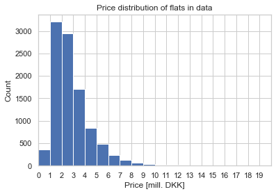


A few points about the target variable:
- Not normally distributed
- Left skewed
- Peaked at 1 - 3 mill DKK
- Very few observations above 6 mill DKK

That the target variable is not normally distributed is not an issue, just an observation. However, the error after a linear regression should be and the predictor variables need to be independent and homoscedastict. 
The bulk of the data is below 6 mill DKK have an impact on the precision if a flat is predicted to be priced at this level or above.


```python
flat['room_nr'].value_counts().sort_index().plot(kind='bar')
plt.title('Number of rooms distribution in the data')
plt.xlabel('Number of rooms')
plt.ylabel('Count')
plt.show()
```


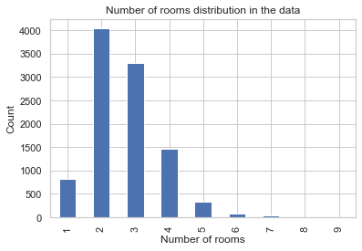


The bulk of the data lies between 2-4 rooms. Same consequence as above.


```python
plt.hist(flat['sqm'], bins=range(0, 300, 20))
plt.xlim([0, 300])
plt.xticks(list(range(0, 300, 20)), list(range(0,300, 20)), rotation = -45)
plt.title('Flat size distribution in the data')
plt.xlabel('Flat size [m^2]')
plt.ylabel('Count')
plt.show()
```


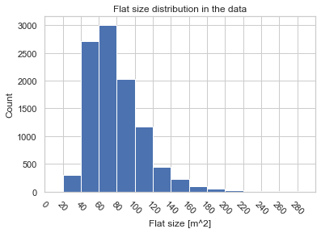


Bulk of the data is in the range 40 - 120 $m^2$. Same consequence as above.


```python
flat['floor'].value_counts()[['kl','st','1','2','3','4','5','6',
                              '7','8','9','10','11','12','13','14',
                              '15','16','17','18','19','20','21',
                              '22','23','24','25','26','27','28',
                              '29'
                            ]].plot(kind='bar')
plt.title('The floor of the flats sold in data')
plt.xlabel('Floor')
plt.ylabel('Count')
plt.show()
```


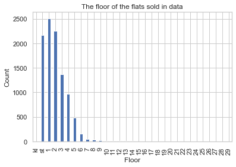


It is seen that the majority of flats sold lies within st. to 4th floor which is a common size of buildings with flats in Copenhagen. 


```python
flat_year_built = flat['year_built'].value_counts().sort_index().reset_index()
plt.figure(figsize=(35,10))
sns.barplot(data=flat_year_built, x='index', y='year_built', color='steelblue')
plt.xticks(rotation = -90)
plt.title('Building year of the flats sold in data')
plt.xlabel('Year built')
plt.ylabel('Count')
plt.show()
```


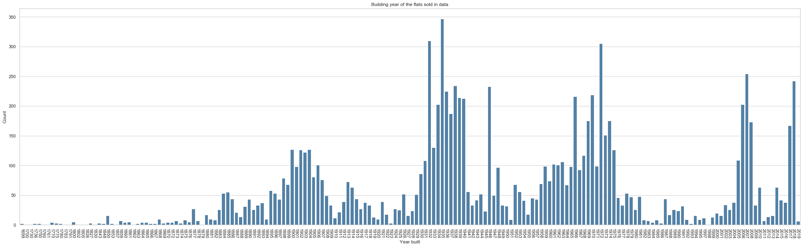


4 distrinct building periods can be seen from this graph.

The number of flats sold in each settlement and the average price of flats sold in each are shown here:


```python
# Number of flats sold in each zip code
flat_zip = flat['settlement'].value_counts().sort_index().reset_index()
plt.figure(figsize=(35,10))
sns.barplot(data=flat_zip, x='index', y='settlement', color='steelblue')
plt.xticks(rotation = -90)
plt.title('Settlement/borough of the flats sold in data')
plt.xlabel('Settlement')
plt.ylabel('Count')
plt.show()

# The average price of flats sold in each settlement
flat_ave_price_pr_zip = flat.groupby('settlement')['price'].mean().sort_index().reset_index()
plt.figure(figsize=(35,10))
sns.barplot(data=flat_ave_price_pr_zip, x='settlement', y='price', color='steelblue')
plt.xticks(rotation = -90)
plt.title('Average price of flats sold in each settlement/borough')
plt.xlabel('settlement')
plt.ylabel('Average price [DKK]')
plt.show()

# The average price change of flats sold in each settlement
flat_ave_price_pr_zip = flat.groupby('settlement')['price_change'].mean().sort_index().reset_index()
plt.figure(figsize=(35,10))
sns.barplot(data=flat_ave_price_pr_zip, x='settlement', y='price_change', color='steelblue')
plt.xticks(rotation = -90)
plt.title('Average price change of flats sold in each settlement/borough')
plt.xlabel('settlement')
plt.ylabel('Average price change [%]')
plt.show()
```


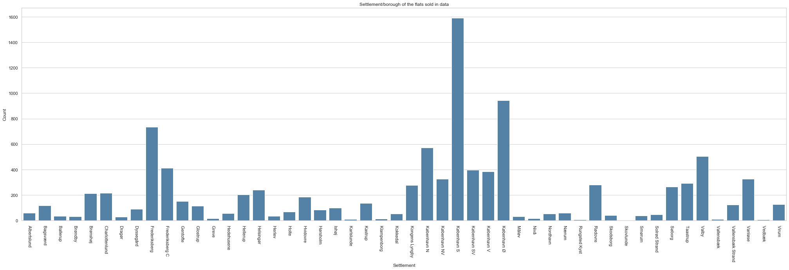


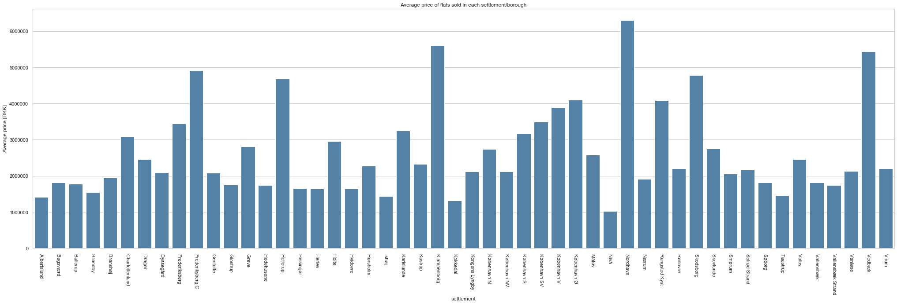


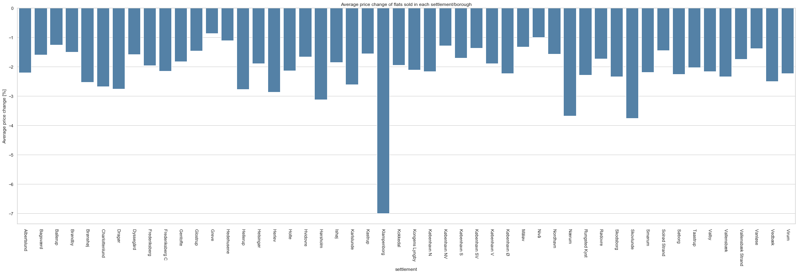


This concludes the univariate distributions. The next step is to investigate the relationship between the target variable and the predictors. This is started with a pearson's correlation matrix.


```python
cor = flat.corr(method='spearman')
sns.heatmap(cor, annot=True, cmap=plt.cm.coolwarm, vmin=-1, vmax=1)
plt.title('Spearman correlations between all numeric variables')
plt.show()
```


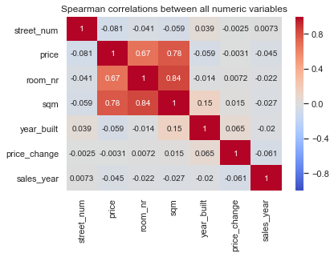


```python
cor = flat.corr()
sns.heatmap(cor, annot=True, cmap=plt.cm.coolwarm, vmin=-1, vmax=1)
plt.title('Pearson correlations between all numeric variables')
plt.show()
```


The matrix clear show that price depends on 2 variable; $sqm$ and $room_nr$. These two variables have a high degree of intercorrelation as expected. This multi-collinearity violates one of the assumption in linear regression. If linear regression it to be attempted one can utilise one of two methods; 1. drop one of the variable or 2. engineer a composite variable from the two. Surprisingly none of the other variables correlate with $price$. However, I do suspect that including more than just $price$ (and any of the so far unexplored variables) in a model may have a positive influence on prediction accuracy. 
The number of rooms in a flat is really a categorical variable and its relationship with $price$ is shown here:


```python
sns.boxplot(data=flat, x='room_nr', y='price')
plt.title('Price vs number of rooms')
plt.xlabel('Number of rooms')
plt.ylabel('Price [DKK]')
plt.show()
```


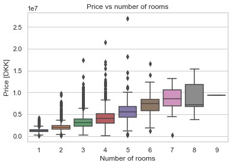


It appears that $price$ and $room_nr$ are linearly related. The largest amount of outliers are found in flats with 2-4 rooms, which corresponds to the bulk of the data range as shown previously.
The price is plotted against $sqm$ here:


```python
sns.scatterplot(data=flat, x='sqm', y='price', alpha=0.2)
plt.title('Price vs sqm')
plt.xlabel('Flat size (m^2)')
plt.ylabel('Price [DKK]')
plt.show()
```


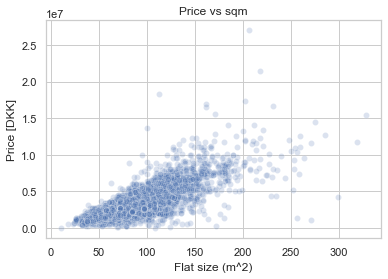


There seems to be a linear relationship here too. However, as the variance in the data increases with the size of a flat another of the assumption in linear regression, namely heteroscedasticity, is violated. It would appear that a linear regression based on a composite sqm/room_nr variable would be the simplest choice of model for predicting the price of a flat. However, the $street$ variable has not been taken into account and there can be huge difference between street nearby each other. The $street$ variable is currently a text variable, but can be viewed as a categorical variable with many many categories and only a few observations of each. An ordinary approach to include categorical variables in a regression is to utilise dummy variables. In this case the number of variables would increase quite a lot and most of the data will be simple 0's. That will increase the computational effort of training an evaluating a model. 


```python
sns.scatterplot(data=flat, x='street_num', y='price', alpha=0.2)
plt.title('Price vs street number')
plt.xlabel('Street number')
plt.ylabel('Price [DKK]')
plt.show()
```


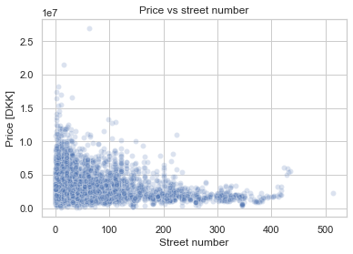


The correlation heat map showed that there is no correlation between the price of a flat and it street number. However, larger numbers do seem to mean lower prices on flats. So the street number may be able to info a model even though no correlation is shown. There are more flats with lower street number, naturally, and there is a larger spread in the prices. The information from this parameter would then be; if there is a large street number, then the price is low. Nothing can be said for lower numbers. 

### Preparing for model building ###

Some additional exploration can be initiated before continuing onto building a model for prediction. One thing would be to get a fell for variable importance. So far it has been shown that the price correlates nicely with $sqm$ / $room_nr$ and there is a considerable variation in price depending on the zip code. Using a Lasso regression (un-tuned and not performing very well) one can get the variable importance from the magnitude of each predictors coefficient after fitting. In order to be able to fit a regression with categorical variables dummy coding of these is performed before fitting:


```python
flat.head()
```


<div>
<style>
    .dataframe thead tr:only-child th {
        text-align: right;
    }

    .dataframe thead th {
        text-align: left;
    }

    .dataframe tbody tr th {
        vertical-align: top;
    }
</style>
<table border="1" class="dataframe">
  <thead>
    <tr style="text-align: right;">
      <th></th>
      <th>street</th>
      <th>street_num</th>
      <th>floor</th>
      <th>settlement</th>
      <th>price</th>
      <th>sales_date</th>
      <th>room_nr</th>
      <th>sqm</th>
      <th>year_built</th>
      <th>price_change</th>
      <th>sales_year</th>
    </tr>
  </thead>
  <tbody>
    <tr>
      <th>3</th>
      <td>Delta Park</td>
      <td>32</td>
      <td>11</td>
      <td>Vallensbæk Strand</td>
      <td>3200000</td>
      <td>2018-11-07</td>
      <td>2</td>
      <td>95</td>
      <td>2007</td>
      <td>-2</td>
      <td>2018</td>
    </tr>
    <tr>
      <th>10</th>
      <td>Tom Kristensens Vej</td>
      <td>30</td>
      <td>3</td>
      <td>København S</td>
      <td>3900000</td>
      <td>2018-02-11</td>
      <td>3</td>
      <td>97</td>
      <td>2006</td>
      <td>-2</td>
      <td>2018</td>
    </tr>
    <tr>
      <th>15</th>
      <td>Dirch Passers Allé</td>
      <td>15</td>
      <td>5</td>
      <td>Frederiksberg</td>
      <td>4075000</td>
      <td>2018-11-22</td>
      <td>3</td>
      <td>86</td>
      <td>2008</td>
      <td>-3</td>
      <td>2018</td>
    </tr>
    <tr>
      <th>19</th>
      <td>Delta Park</td>
      <td>32</td>
      <td>2</td>
      <td>Vallensbæk Strand</td>
      <td>2450000</td>
      <td>2018-08-31</td>
      <td>4</td>
      <td>103</td>
      <td>2007</td>
      <td>0</td>
      <td>2018</td>
    </tr>
    <tr>
      <th>22</th>
      <td>Dirch Passers Allé</td>
      <td>13</td>
      <td>2</td>
      <td>Frederiksberg</td>
      <td>3850000</td>
      <td>2018-01-17</td>
      <td>3</td>
      <td>95</td>
      <td>2008</td>
      <td>-4</td>
      <td>2018</td>
    </tr>
  </tbody>
</table>
</div>


```python
# Price change is related to price in such a way that it does not convey any
# additional information, and hence it is dropped. sales_year and sales_date are redundant too.
flat = flat.drop(['price_change', 'sales_year', 'sales_date'], axis=1)

flat = pd.get_dummies(flat, columns=['floor'], prefix='floor', drop_first=True)
flat = pd.get_dummies(flat, columns=['street'], prefix='street', drop_first=True)
flat = pd.get_dummies(flat, columns=['settlement'], prefix='settlement', drop_first=True)
```


```python
# Create features and target sets
X = flat.drop('price', axis=1)
y = flat['price'].to_frame()

# Create train and test dataframes
X_train, X_test, y_train, y_test = train_test_split(X, y, test_size=0.3, 
                                                    random_state=42)
```


```python
lasso = Lasso(alpha=0.1, tol=1)

lasso_model = lasso.fit(X_train, y_train)
lasso_coef = lasso_model.coef_

predictors = flat.drop('price', axis=1).columns
plt.figure(figsize=(35,10))
plt.plot(range(len(predictors)), lasso_coef)
plt.title('Predictor coefficient magnitude')
plt.xticks(range(len(predictors)), predictors, rotation=60)
plt.ylabel('Coefficients')
plt.show()
```


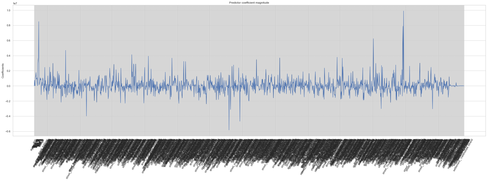


The almost zero cofficient magnitude tail to this figure are the coefficients of the settlement dummy variables. It is seen that performing a Lasso regression the zip code of a flat is irrelevant. A previous plot contradicts this however. The bulk of the predictors are the streets (long names on the plot) and they display; 1. a lot of variation and 2. a high degree of importance. This plot is used to confirm that the street of a flat is indeed important to carry into the modelling.

The coefficients $> abs(0.4)$ are shown below in descending order.


```python
lasso_model.coef_[(lasso_model.coef_ > 0.2) | (lasso_model.coef_ < -0.2)]
```


    array([ -2457.85468246, 740486.02616302,  20005.28132872, ...,
            17090.30300568,  -2477.16768807,  -2659.40246884])


```python
# Extract features with model coefficients
coefficients = pd.concat([pd.DataFrame(X_train.columns),pd.DataFrame(np.transpose(lasso_model.coef_))], axis = 1)
# Set columns names
coefficients.columns = ['feature', 'coef']
```


```python
# Get only features of desired magnitude
features_mag = coefficients[(coefficients.coef > 0.2*10**7) | (coefficients.coef < -0.2*10**7)]
```


```python
features_mag
```


<div>
<style>
    .dataframe thead tr:only-child th {
        text-align: right;
    }

    .dataframe thead th {
        text-align: left;
    }

    .dataframe tbody tr th {
        vertical-align: top;
    }
</style>
<table border="1" class="dataframe">
  <thead>
    <tr style="text-align: right;">
      <th></th>
      <th>feature</th>
      <th>coef</th>
    </tr>
  </thead>
  <tbody>
    <tr>
      <th>12</th>
      <td>floor_20</td>
      <td>3.008762e+06</td>
    </tr>
    <tr>
      <th>13</th>
      <td>floor_21</td>
      <td>3.458803e+06</td>
    </tr>
    <tr>
      <th>14</th>
      <td>floor_24</td>
      <td>3.738239e+06</td>
    </tr>
    <tr>
      <th>15</th>
      <td>floor_29</td>
      <td>8.488313e+06</td>
    </tr>
    <tr>
      <th>35</th>
      <td>street_Ahlmanns Alle</td>
      <td>2.447463e+06</td>
    </tr>
    <tr>
      <th>51</th>
      <td>street_Amager Strandvej</td>
      <td>2.472481e+06</td>
    </tr>
    <tr>
      <th>62</th>
      <td>street_Annasvej</td>
      <td>2.973121e+06</td>
    </tr>
    <tr>
      <th>89</th>
      <td>street_Bakkekammen</td>
      <td>-2.166672e+06</td>
    </tr>
    <tr>
      <th>104</th>
      <td>street_Bellevuevej</td>
      <td>4.696602e+06</td>
    </tr>
    <tr>
      <th>148</th>
      <td>street_Borgmester Jensens Allé</td>
      <td>2.063232e+06</td>
    </tr>
    <tr>
      <th>173</th>
      <td>street_Brogårdsvej</td>
      <td>-3.990054e+06</td>
    </tr>
    <tr>
      <th>207</th>
      <td>street_Camilla Nielsens Vej</td>
      <td>-2.156891e+06</td>
    </tr>
    <tr>
      <th>250</th>
      <td>street_Dampfærgevej</td>
      <td>2.336854e+06</td>
    </tr>
    <tr>
      <th>264</th>
      <td>street_Drechselsgade</td>
      <td>2.841280e+06</td>
    </tr>
    <tr>
      <th>271</th>
      <td>street_Drosselvej</td>
      <td>2.142426e+06</td>
    </tr>
    <tr>
      <th>286</th>
      <td>street_Ejby Smedevej</td>
      <td>-2.247197e+06</td>
    </tr>
    <tr>
      <th>287</th>
      <td>street_Ejgårdsparken</td>
      <td>2.336592e+06</td>
    </tr>
    <tr>
      <th>301</th>
      <td>street_Emdrupgårdsvej</td>
      <td>-2.299923e+06</td>
    </tr>
    <tr>
      <th>323</th>
      <td>street_Eskeager</td>
      <td>4.126081e+06</td>
    </tr>
    <tr>
      <th>329</th>
      <td>street_Evanstonevej</td>
      <td>2.900060e+06</td>
    </tr>
    <tr>
      <th>330</th>
      <td>street_Ewalds Have</td>
      <td>2.778535e+06</td>
    </tr>
    <tr>
      <th>336</th>
      <td>street_Falkoner Alle</td>
      <td>2.886820e+06</td>
    </tr>
    <tr>
      <th>363</th>
      <td>street_Fredensvej</td>
      <td>-2.281009e+06</td>
    </tr>
    <tr>
      <th>366</th>
      <td>street_Frederiksberg Alle</td>
      <td>2.438836e+06</td>
    </tr>
    <tr>
      <th>378</th>
      <td>street_Frydendalsvej</td>
      <td>3.930246e+06</td>
    </tr>
    <tr>
      <th>387</th>
      <td>street_Fælledvej</td>
      <td>2.230560e+06</td>
    </tr>
    <tr>
      <th>456</th>
      <td>street_Göteborg Plads</td>
      <td>3.668941e+06</td>
    </tr>
    <tr>
      <th>479</th>
      <td>street_Hareskovvej</td>
      <td>-2.318538e+06</td>
    </tr>
    <tr>
      <th>495</th>
      <td>street_Helgolandsgade</td>
      <td>3.235326e+06</td>
    </tr>
    <tr>
      <th>501</th>
      <td>street_Helsinkigade</td>
      <td>3.217918e+06</td>
    </tr>
    <tr>
      <th>...</th>
      <td>...</td>
      <td>...</td>
    </tr>
    <tr>
      <th>660</th>
      <td>street_Kong Georgs Vej</td>
      <td>2.756439e+06</td>
    </tr>
    <tr>
      <th>677</th>
      <td>street_Kristianiagade</td>
      <td>2.378472e+06</td>
    </tr>
    <tr>
      <th>681</th>
      <td>street_Kronprinsensvej</td>
      <td>-4.678463e+06</td>
    </tr>
    <tr>
      <th>711</th>
      <td>street_Leen D</td>
      <td>-2.005404e+06</td>
    </tr>
    <tr>
      <th>736</th>
      <td>street_Lundsgade</td>
      <td>3.464371e+06</td>
    </tr>
    <tr>
      <th>767</th>
      <td>street_Malmøgade</td>
      <td>2.187247e+06</td>
    </tr>
    <tr>
      <th>813</th>
      <td>street_Murmanskgade</td>
      <td>3.688609e+06</td>
    </tr>
    <tr>
      <th>961</th>
      <td>street_Rosenvængets Allé</td>
      <td>2.359101e+06</td>
    </tr>
    <tr>
      <th>1003</th>
      <td>street_Sandkaj</td>
      <td>3.784915e+06</td>
    </tr>
    <tr>
      <th>1020</th>
      <td>street_Scherfigsvej</td>
      <td>3.658562e+06</td>
    </tr>
    <tr>
      <th>1022</th>
      <td>street_Schlegels Alle</td>
      <td>2.521222e+06</td>
    </tr>
    <tr>
      <th>1088</th>
      <td>street_Sortedam Dossering</td>
      <td>2.402048e+06</td>
    </tr>
    <tr>
      <th>1112</th>
      <td>street_Stockholmsgade</td>
      <td>2.538498e+06</td>
    </tr>
    <tr>
      <th>1122</th>
      <td>street_Strandparksvej</td>
      <td>2.612095e+06</td>
    </tr>
    <tr>
      <th>1123</th>
      <td>street_Strandpromenaden</td>
      <td>6.234157e+06</td>
    </tr>
    <tr>
      <th>1131</th>
      <td>street_Sturlasgade</td>
      <td>2.974212e+06</td>
    </tr>
    <tr>
      <th>1149</th>
      <td>street_Sydvestvej</td>
      <td>-3.017035e+06</td>
    </tr>
    <tr>
      <th>1150</th>
      <td>street_Sylows Alle</td>
      <td>2.701238e+06</td>
    </tr>
    <tr>
      <th>1153</th>
      <td>street_Søbakken</td>
      <td>2.483725e+06</td>
    </tr>
    <tr>
      <th>1180</th>
      <td>street_Teglværksbakken</td>
      <td>-2.183011e+06</td>
    </tr>
    <tr>
      <th>1190</th>
      <td>street_Thorvaldsensvej</td>
      <td>2.092278e+06</td>
    </tr>
    <tr>
      <th>1197</th>
      <td>street_Tingvej</td>
      <td>2.760981e+06</td>
    </tr>
    <tr>
      <th>1218</th>
      <td>street_Trondhjemsgade</td>
      <td>2.147280e+06</td>
    </tr>
    <tr>
      <th>1220</th>
      <td>street_Tuborg Boulevard</td>
      <td>5.270325e+06</td>
    </tr>
    <tr>
      <th>1221</th>
      <td>street_Tuborg Havnepark</td>
      <td>7.870459e+06</td>
    </tr>
    <tr>
      <th>1223</th>
      <td>street_Tuborg Sundpark</td>
      <td>9.891518e+06</td>
    </tr>
    <tr>
      <th>1243</th>
      <td>street_Upsalagade</td>
      <td>2.608900e+06</td>
    </tr>
    <tr>
      <th>1277</th>
      <td>street_Ved Ørehøj</td>
      <td>3.009036e+06</td>
    </tr>
    <tr>
      <th>1314</th>
      <td>street_Vodroffsvej</td>
      <td>2.458831e+06</td>
    </tr>
    <tr>
      <th>1319</th>
      <td>street_Værnedamsvej</td>
      <td>-3.045514e+06</td>
    </tr>
  </tbody>
</table>
<p>64 rows × 2 columns</p>
</div>


Interestingly the only types of features with a coefficient magnitude above the set threshold are streets (primarily) and high floor numbers. This reinforces the initial belief that the street is highly relevant and also indicates that flat situated high above ground level are indeed important - perhaps due to the presumable nice view. However, it is suprising that the highly correlating $sqm$ and $room\_nr$ are not present. So the conclusions from this exercise are not fool-proof.


```python

```
